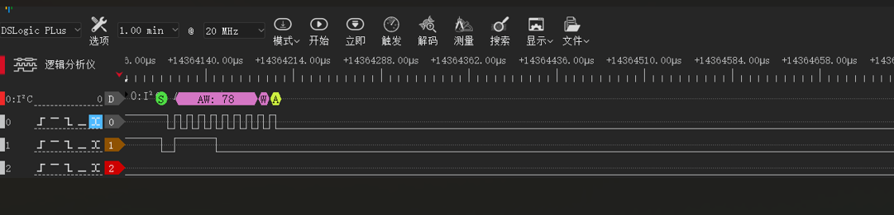
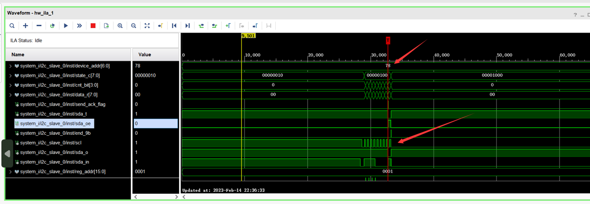
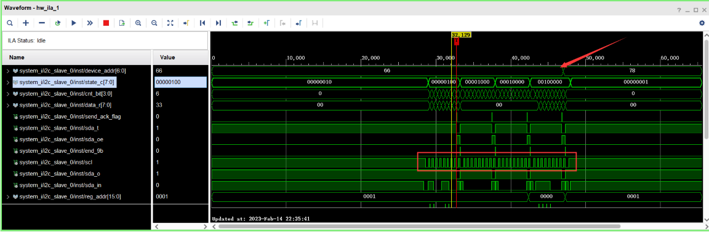
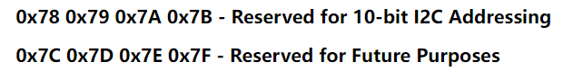

## 
    i2c_slave

    使用FPGA实现的一个I2C从机模块，可读可写，可改设备地址，可扩展，模拟摄像头内部的sensor

有三个IP:
   	 1、origin是从别处copy的代码，功能有限，未使用过
   	 2、updata是我参考origin里的设计思路进行修改扩展，经过仿真与上板测试无误，可读可写，可连读连写，默认地址0x00是设备寄存器地址，可动态修改，可根据需模拟的寄存器数据填表，可根据需求再扩展
    	3、made by Z是同事张工的版本（https://github.com/yxgi5/i2c_slave），也可实现updata功能，未加入动态修改地址功能，但逻辑较复杂，代码可读性emmmmmmm

在动态设备地址实验测试时，在图莫斯工具下，发现地址0x78、0x79、0x7a有问题，设备地址改了，但从机没有回复与应答

通过逻辑分析仪发现，scl时钟线一直被拉低

    

    

正常情况下

Device addr为77，通过地址0x000改变地址为78，可看到scl正常时钟线

    

通过查资料发现

    

https://www.cnblogs.com/schips/p/i2c-addresses.html

**但在zynq上可以正常访问并读写到0x78，结论图莫斯工具将其限制了**
